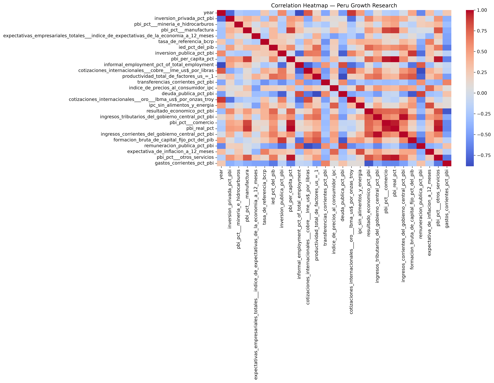
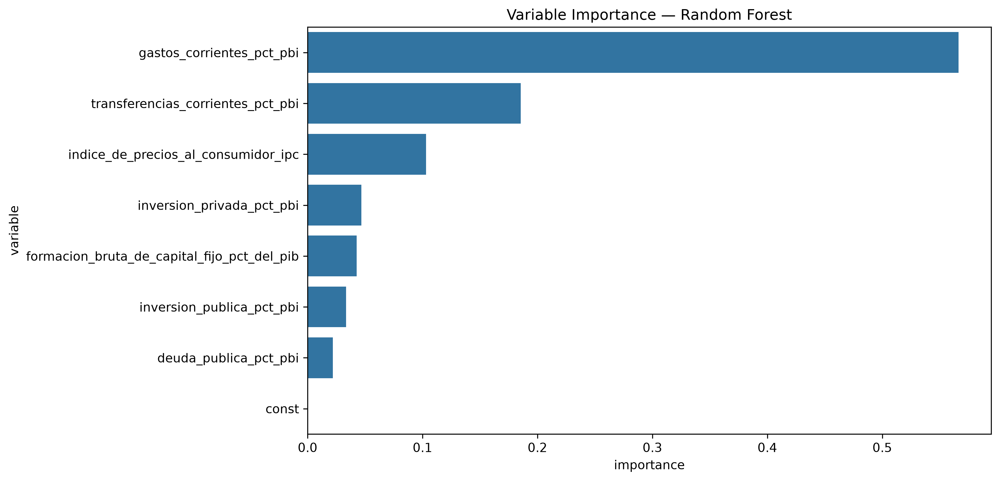
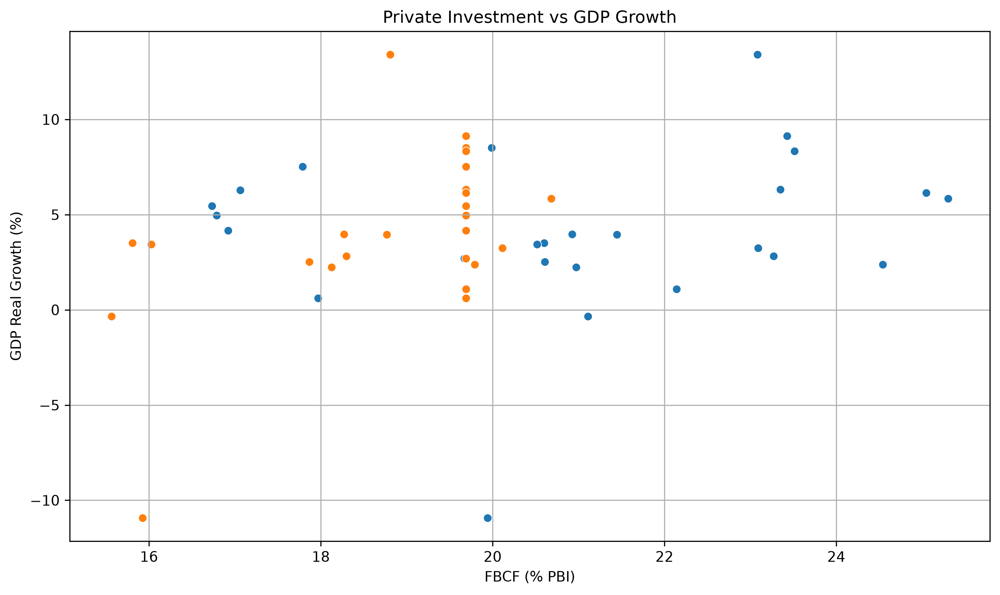
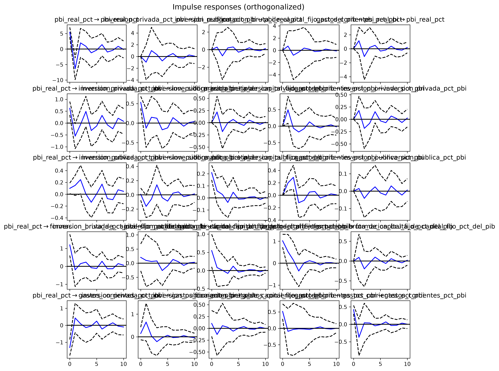
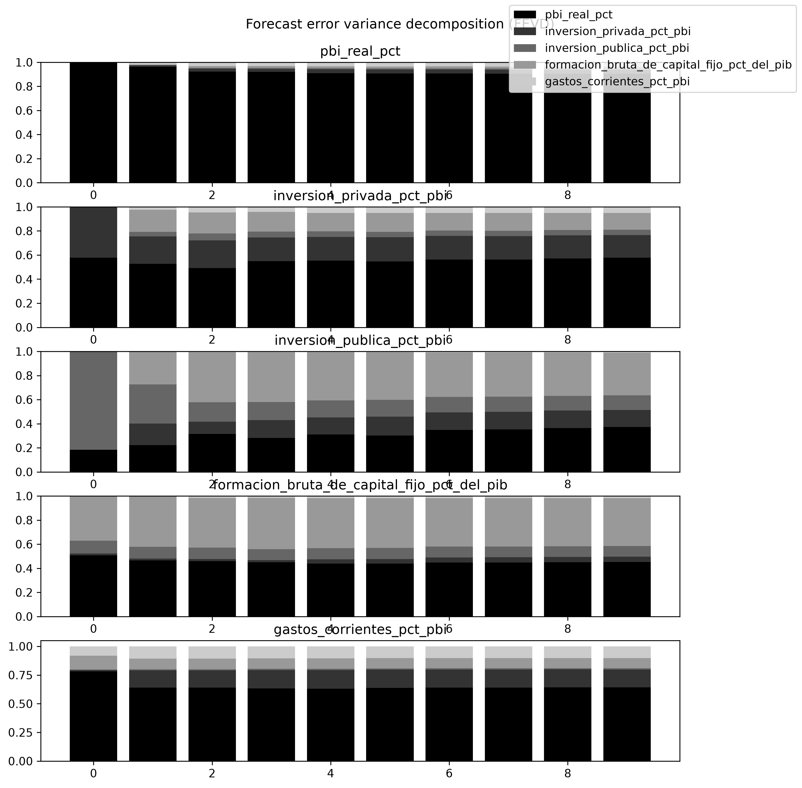

# 📘 Peru Growth Research Tool

## Personal Note

This project was developed independently to advance my skills from university courses in **Applied Financial Econometrics**, **Financial Intermediation**, **Machine Learning**, and **Python-based research workflows**.

I used **Microsoft Copilot** as a development companion to structure, debug, and refine the methodology.  
It may still be missing some refinements, but it reflects my progress and learning so far.

---

## ⚠️ Important Disclaimers

### Methodology Disclaimer
While the methodology follows established academic practices, the results should be interpreted as **preliminary and exploratory**.

### Data Limitations
The analysis is based on a limited sample of **26 annual observations**. This small sample size:

- limits statistical power and inference  
- increases sensitivity to multicollinearity  
- constrains the ability to estimate complex time-series models  
- may produce unstable coefficients across different model specifications  

### Time-Series Analysis Caveat
The time-series analysis (VAR, IRF, FEVD) was conducted on **non-stationary variables without appropriate differencing**.  
Although the Johansen cointegration test suggests long-run relationships exist, the VAR estimates should be interpreted with **extreme caution**.

Future iterations will implement a proper **Vector Error Correction Model (VECM)** to address this methodological limitation.

### Instrumental Variables Caveat
The IV/2SLS results use instruments selected based on economic theory.  
However, due to the small sample size:

- weak instrument diagnostics (first-stage F-statistics) cannot be reliably estimated  
- Sargan/Hansen overidentification tests lack statistical power  
- instrument validity is theoretically motivated but **empirically unverified**

---

## Model Description

The Peru Growth Research Tool is built around a **multi‑method econometric and machine learning pipeline** designed to understand the drivers of Peru's real GDP growth.  
Instead of relying on a single model, the tool integrates:

- classical econometrics  
- machine learning  
- dynamic time-series analysis  

to produce a robust, policy-relevant analysis.

### Core Idea

Macroeconomic variables behave differently depending on underlying structural conditions.  
This project identifies and analyzes these conditions using:

- **Static econometric models** (OLS, IV/2SLS)  
- **Predictive machine learning models** (Random Forest)  
- **Dynamic time‑series models** (ADF, Johansen, VAR, IRF, FEVD)

The goal is to extract **stable, interpretable signals** from noisy macroeconomic data and understand how fiscal and investment variables influence growth.

---

## Econometric Framework

### 1. Classical Econometrics (OLS & IV)

These models estimate the direct relationship between growth and its determinants.

- OLS provides baseline coefficients and signs.  
- IV corrects for endogeneity using macroeconomic instruments.  
- **Most variables are statistically insignificant**, reflecting multicollinearity and small sample size.  
- **Current expenditure becomes significant under IV**, confirming its negative impact on growth.

---

### 2. Machine Learning (Random Forest)

Random Forest identifies **which variables matter most**, even when statistical significance is weak.

- Current expenditure is the **dominant negative driver**.  
- Transfers and inflation follow as secondary contributors.  
- Investment variables show lower predictive importance.

---

### 3. Time Series Dynamics (VAR, IRF, FEVD)

> Note: Interpretations are **exploratory** due to the stationarity issues noted in the disclaimer.

These models capture how shocks propagate through the economy.

- Public investment behaves **countercyclically** (preliminary evidence).  
- Shocks to current expenditure reduce growth **persistently** (requires VECM validation).  
- FEVD suggests growth variance is mostly explained by fiscal variables (subject to model specification).

---

## 📁 Repository Structure 

Below is the structure for the Peru Growth Research Tool:

```
Peru-research/
│
├── data/                          # Raw datasets (26 CSV files)
│   ├── *.csv
│
├── dataCleaned/                  # Cleaned and merged dataset
│   └── dataset_clean.csv
│
├── results/                      # Automatically generated outputs
│   ├── results.md                # Full econometric + ML + time-series report
│   └── plots/                    # All saved visualizations
│       ├── correlation_heatmap.png
│       ├── random_forest_importance.png
│       ├── scatter_private_investment_vs_growth.png
│       ├── irf.png
│       └── fevd.png
│
├── research.py                   # Main pipeline script
└── README.md                     # Project documentation
```

## 🧠 Key Findings

Across all econometric methods, the results converge on a robust insight:

> **Current government expenditure is the strongest negative determinant of Peru's real GDP growth in this dataset.**

### Additional Findings

Most variables are **statistically insignificant** in OLS and IV, mainly due to:

- multicollinearity  
- small sample size  
- macroeconomic volatility  

Other insights:

- Private investment is positively associated with growth but **not statistically significant**.  
- Public investment behaves countercyclically but is **not statistically significant**.  
- FBCF shows the expected positive sign but is **not statistically significant**.  
- Inflation has a mild positive effect but is **not statistically significant**.  
- Growth, investment, and fiscal variables show evidence of **cointegration** in the long run (Johansen test).  
- Shocks to current expenditure have the **largest negative impact** on future growth (preliminary finding).

---

## 📊 Econometric Results Summary

### **OLS Regression**

- R² = **0.648**  
- Signs are economically consistent  
- **None of the variables are statistically significant** at conventional levels  
- Multicollinearity is present (**Condition Number ≈ 1500**)

---

### **IV / 2SLS Regression**

- R² = **0.638**  
- **Current expenditure becomes statistically significant (p = 0.017)**  
- All other variables remain **insignificant**, confirming weak statistical power  
- Instruments are economically motivated, but sample size limits formal validation

---

### **Random Forest**

- Provides variable importance ranking  
- Confirms **current expenditure dominates**, even when OLS/IV lack significance  
- Machine learning helps identify predictive patterns despite small‑sample limitations

## Visual Outputs

### 🔥 Correlation Heatmap  
Shows relationships between all macroeconomic variables.  


---

### 🌲 Random Forest Variable Importance  
Machine learning ranking of which variables matter most for GDP growth.  


---

### 📈 Private Investment vs GDP Growth  
Scatterplot showing the relationship between private investment and real GDP growth.  


---

### 📉 Impulse Response Functions (IRF)  
Dynamic effects of shocks on GDP growth and investment.  


---

### 📊 Forecast Error Variance Decomposition (FEVD)  
Shows which variables explain future GDP growth variance.  


---


